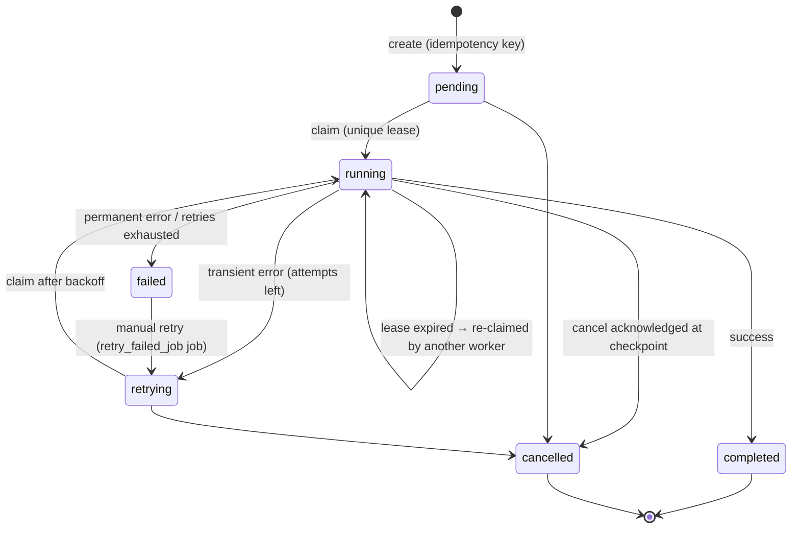

# EzDistro Platform — Architecture

A production SEO-automation platform: it **indexes** WordPress content into a vector
database and **writes** complete, SEO-scored articles from topics with an LLM, then
publishes them back to WordPress through an explicit human review workflow.

Built as a **modular monolith**: one FastAPI web process (HTMX + DaisyUI UI),
one standalone asyncio worker process, PocketBase as the source of truth, Qdrant for
vectors. No Redis, no Celery, no n8n.

```text
Documentation status:  Verified against the working tree (research engine)
Last verified:         2026-10-04
Companion documents:   SCHEMA.md · CONFIGURATION.md · OPERATIONS.md · TROUBLESHOOTING.md
                       USER-GUIDE.md · FAILURES.md · SEO_RESEARCH.md
```

---

## 1. System context

```
┌────────────────────┐        ┌──────────────────────────────┐
│  Web process       │        │  Worker process (asyncio)    │
│  FastAPI + HTMX    │        │  poll → claim → run handlers │
│  creates jobs      │        │  schedules → jobs            │
│  (idempotent)      │        │  heartbeat / retry / cancel  │
└─────────┬──────────┘        └───────────┬──────────────────┘
          │                               │
          └───────────┬───────────────────┘
                      ▼
             ┌─────────────────┐        vectors only
             │   PocketBase    │  ───▶  ┌─────────┐
             │ (source of      │        │ Qdrant  │◀─ worker
             │  truth)         │        └─────────┘
             └─────────────────┘
                      ▲ provider HTTP calls (worker side)
   ┌──────────┬───────┼──────────────┬───────────────┬──────────────┐
   ▼          ▼       ▼              ▼               ▼              ▼
 LLM APIs  Embedding  WordPress   Google Ads      SERP          (Qdrant
(OpenAI-   /Rerank    REST        API (OAuth;     provider       above)
 compat,   (Cohere-   application optional,       (optional,
 Gemini,   compatible) passwords  research only)  research only)
 Ollama)
```

### Data ownership

| Store | Owns |
|---|---|
| **PocketBase** | Everything relational: projects, settings (incl. image-generation and multilingual config), integrations (encrypted secrets; categories incl. `image`, `serp`, `google_ads`), prompts (incl. `image_plan_*`, `research_*`, `cluster_*`, `opportunity_*`), topics, articles (incl. WordPress-mirror fields), sections, revisions, article images, documents metadata, index runs, jobs / leases / job events, publishing runs, provider metrics, schedules, worker heartbeats, app settings, project members, and the 13 research collections (`google_ads_connections`/`customers`, `research_runs`/`seeds`, `keywords`, `keyword_metrics`, `keyword_volumes`, `clusters`, `competitor_pages`, `content_gaps`, `article_ideas`, `serp_queries`/`results`) |
| **Qdrant** | Vectors + payload (chunk text, source URL, title, ids). No vector data is duplicated into PocketBase; no secrets live in Qdrant payloads |
| **External providers** | LLM generations, embeddings, reranking, WordPress posts, Google Ads Keyword Planner (research), SERP observations (research, optional) |

## 2. Process model

Two independent processes share the PocketBase database; correctness never depends on
worker memory.

| Process | Command | Notes |
|---|---|---|
| Web | `uvicorn app.main:app --reload --port 8000` (`make web`) | Serves the HTMX UI on port **8000**; creates jobs idempotently |
| Worker | `python -m app.workers.worker` (`make worker`) | Needs `PB_ADMIN_EMAIL` / `PB_ADMIN_PASSWORD` |

The worker runs three async loops until SIGINT/SIGTERM:

1. **Job poll loop** — every `POLL_INTERVAL_SECONDS` (default 5): claims due jobs and
   executes them under a global semaphore.
2. **Schedule loop** — every `SCHEDULE_POLL_INTERVAL_SECONDS` (default 60, floor 10):
   turns due per-project schedules into jobs (idempotent per time window).
3. **Metrics loop** — every 30 s: flushes accumulated provider metrics to PocketBase
   and closes idle pooled HTTP clients.

Any number of workers can run concurrently; atomic lease claiming makes this safe.

## 3. Code layout & layering

```
app/
  main.py            FastAPI app factory (web process); mounts routers + middleware
  config.py          pydantic-settings; all env-driven configuration
  middleware.py      AuthMiddleware: PB cookie auth + req-id correlation + gate
  pb.py              PocketBase client factories (auto_snake_case=False!)
  templates.py       Jinja2 env + locale date/number filters + status badge styles
  utils.py           HTMX response helpers (hx_toast, mutation_response, …)
  api/               HTTP/HTMX routers — auth, dashboard, projects, articles,
                     images, research, workspace, jobs, workers, logs
                     (+ dev-only debug)
  routes/            pwa (manifest/sw/offline), debug (dev only)
  domain/            Pure logic, zero I/O: chunker, parsing, prompt_render,
                     article_html, sanitize, seo_score, validation,
                     article_validation, keywords, images, seo_enforce
  schemas/           Pydantic models for LLM outputs & retrieval results
  repositories/      The ONLY code that talks to PocketBase (33 collections)
  providers/         External adapters behind protocols + table-driven registry
                     (llm, embedding, reranker, vector_store, publisher, image,
                     serp, google_ads)
  services/          Orchestration: indexing, writing, publishing_service,
                     retrieval, internal_linking, scheduler, secrets, settings,
                     stats, metrics, revisions, outline_editor, prompt_service,
                     wordpress_sync, and the research engine (research,
                     research_keywords, research_competitors, research_clustering,
                     research_opportunities, research_handoff, research_import,
                     google_ads)
  jobs/              Engine: state machine, claim/heartbeat/retry/finalize,
                     handler registry (@register_job), JobContext
  workers/worker.py  Worker entrypoint
scripts/bootstrap_pb.py  Idempotent schema bootstrap (source of truth for schema)
```

Layering conventions (by convention, not enforced):

- `domain/` is I/O-free and unit-testable.
- `repositories/` only touch PocketBase.
- `providers/` only touch external APIs; they never know PocketBase exists.
- `services/` orchestrate repositories + providers.
- Long-running work lives **only in job handlers**, never request handlers.
- `app/pb.py` sets `auto_snake_case=False`: field names stay camelCase end-to-end.

## 4. Web request lifecycle

1. `AuthMiddleware` assigns an 8-char `req_id`, binds structured-log context, resolves
   the `pb_auth` cookie against the PocketBase `users` collection, and gates access:
   unauthenticated requests are redirected to `/login` (303) except public paths
   (`/login`, `/static/*`, `/manifest.json`, `/sw.js`, `/favicon.ico`, `/health`,
   `/openapi.json`, `/docs`, `/offline`, and `/`).
2. Route dependencies enforce authorization:
   - Platform roles: `users.role ∈ {admin, member}`. Global admins see everything.
   - Project membership: non-admins are restricted to projects where they have a
     `project_members` row (role `owner > admin > editor > viewer`). An empty
     membership list means **no** access anywhere.
   - `ensure_record_in_project()` rejects records addressed by raw id that belong to a
     different project (anti ID-substitution guard).
   - Mutations additionally require a member role of owner/admin/editor;
     destructive/administrative operations require owner/admin.
3. Mutations are POST/PUT gated by `require_hx` (the `HX-Request` header must be
   present) — a lightweight CSRF mitigation for the HTMX front end.
4. Responses use the helpers in `app/utils.py` (`hx_toast`, `mutation_response`,
   `ok_with_redirect`, `delayed_redirect`, `error_response`) — user-facing toast messages,
   HX event triggers, never raw JSON from UI routes.

Authentication is PocketBase-native: `POST /login` calls
`users.auth_with_password`, stores the token in the `pb_auth` cookie
(`HttpOnly`, `SameSite=Lax`, `Secure` when in production or arrived over TLS,
30-day max-age), and `POST /logout` clears it.

Dev-only surface (disabled when `ENV=production`): Swagger UI at `/docs`,
`/openapi.json`, and a debug router.

## 5. Job engine

The engine (`app/jobs/engine.py`, `app/jobs/state.py`) is the heart of both pipelines.
Every decision is re-read from PocketBase, so a worker may crash at any point without
losing or duplicating work.

### 5.1 States and transitions

Job status enum (PocketBase select): `pending | running | completed | failed | cancelled | retrying`.
There is **no separate `claimed` status** — claiming moves a job straight to `running`
(`job.claimed` is only an *event*).



Transitions are validated centrally (`validate_transition`); illegal transitions raise.

### 5.2 Claiming (atomic)

Each poll cycle fetches up to 50 candidates:

- **fresh**: `(status = pending || status = retrying) && availableAt <= now`,
  ordered by priority desc, created asc;
- **stale**: `status = running && leaseExpiresAt < now` (crash recovery).

The claim is a compare-and-swap built on the **unique index on `job_leases.job`**:
inserting the lease row wins; losers back off. If the existing lease is already
expired it is deleted and the acquire retried once (abandoned-job recovery). After
acquiring, the winner re-reads the job, verifies it is still claimable, transitions it
to `running` with lock fields (`lockedBy`, `lockedAt`, `leaseExpiresAt`, `startedAt`)
and emits `job.claimed`.

### 5.3 Execution

Per claimed job the engine:

1. Emits `job.started`.
2. Loads `ProjectConfig` (project + merged flat settings + resolved active prompts +
   global LLM defaults — batched into ~5 queries).
3. Builds a lazy `ProviderStack`: providers are constructed on first access and wrapped
   in bounded-concurrency proxies (`BoundedLLM`, `BoundedEmbedding`, `BoundedPublisher`).
   A publish-only job never constructs (or fails on) LLM/embedding credentials.
4. Starts a **heartbeat task**: every `HEARTBEAT_INTERVAL_SECONDS` (default 15) it
   extends `heartbeatAt` + `leaseExpiresAt` on the job and the lease row.
5. Runs the registered handler with a `JobContext` (progress, stage events, structured
   info/warning/error events, cancellation checkpoints).
6. Finalizes:
   - return value → `completed` + `result` JSON;
   - `JobCancelled` → `cancelled`;
   - `ProviderError` → classified by `retryable`;
   - any other exception → treated as **transient** (retryable) with the traceback tail
     (last 2000 chars) stored in error details;
   - unknown job type → permanent failure.
7. Releases the lease and closes the providers that were actually built.

### 5.4 Retries, backoff and Retry-After

A transient failure with attempts remaining marks the job `retrying`:

```
delay = min(backoff_base × 2^(attempts−1), backoff_max) × uniform(0.5…1.5)
delay = max(delay, provider_retry_after_seconds)   # when the provider sent Retry-After
availableAt = now + delay
```

`backoff_base` (30 s) and `backoff_max` (3600 s) come from the project's
`retryPolicy`; `max_attempts` defaults to 3. When retries are exhausted — or the error
is permanent (`PermanentError`: bad credentials, invalid requests, schema/validation
failures) — the job lands in `failed` with `errorCode` / `errorMessage` /
`errorDetails`. Only a human retry (`retry_failed_job` job or the UI button) revives a
failed job.

Adapter-level retries are independent: `with_retry` in `app/providers/http.py` wraps
single provider calls (default 3 attempts, exponential base delay 2 s) and captures
the provider's `Retry-After` header into error details so the job layer can honor it.

### 5.5 Cancellation

The UI sets `cancelRequested` on the job (`POST /jobs/{id}/cancel`). Handlers call
`ctx.check_cancelled()` at checkpoints (between posts, between sections, between
batches); when set, `JobCancelled` is raised, the current step finishes cleanly and
the job becomes `cancelled`.

### 5.6 Idempotency

Every job carries a unique `idempotencyKey`; creating a duplicate returns the existing
record instead of raising. Keys used by the system include:

- section generation: `generate:section:{sectionId}`
- assembly: `assemble:article:{articleId}`
- scheduler windows: `index:project:{projectId}:{scheduleId}:{window}` and
  `write:article:{projectId}:{scheduleId}:{window}` — `window = epoch // interval`,
  so a worker restart inside the same interval never double-fires a schedule.
- UI-triggered publish/index actions use action-scoped keys deduplicated against
  active jobs, so repeated clicks do not queue duplicates.

Handlers are idempotent by construction (deterministic point IDs, unique constraints,
update-instead-of-create guards); execution is at-least-once, side effects are
effectively-once. See FAILURES.md for the crash matrix.

### 5.7 Event timeline

Append-only `job_events` rows (never updated) form the audit trail shown in the UI:

| Event | Emitted when |
|---|---|
| `job.created` | job record created |
| `job.claimed` | worker won the lease |
| `job.started` | handler begins |
| `job.stage_started` / `job.stage_completed` | pipeline stage boundaries |
| `info` / `warning` / `error` | handler progress notes |
| `job.provider_error` | classified provider failure |
| `provider_call` | every provider call (only when `PROVIDER_EVENTS_ENABLED=1`) — size/latency/tokens, never content |
| `job.retry_scheduled` | transient failure scheduled for retry (also manual retry) |
| `job.completed` / `job.failed` / `job.cancelled` | terminal states |
| `config.model_changed` | AI-model configuration change audit |

### 5.8 Registered job types

Sixteen types, listed in `JOB_TYPES` (`app/jobs/handlers.py`) — which the worker
and `app/api/jobs.py` derive from — and self-registered via `@register_job(...)`
(imports triggered by `ensure_registered()`):

| Type | Purpose |
|---|---|
| `index_project` | Full/incremental WordPress indexing run (resumable) |
| `index_document` | Index/re-index a single WordPress post |
| `write_article` | Orchestrator: topic → outline → section jobs → assembler |
| `generate_outline` | Outline-only granular job |
| `generate_section` | One independent job per article section |
| `assemble_article` | Wait for sections, assemble, validate → review (auto-chains `plan_article_images`) |
| `publish_article` | WordPress publish/update/unpublish (idempotent, audited; uploads images, sets featured media) |
| `retry_failed_job` | Human retry: resets a failed target job to `retrying` |
| `plan_article_images` | LLM image plan: exactly one cover + ≤ `imageMaxInteriorImages` interiors (§6.6) |
| `generate_cover_image` | Generate the cover slot (role-scoped provider/model, fallback on failure) |
| `generate_interior_image` | Generate one interior slot (`sectionKey` bound) |
| `generate_article_image` | Generic single-image generation entry point (same pipeline as role jobs) |
| `optimize_article_image` | Decode + quality-gate + re-encode to WebP/AVIF/JPEG + small variant |
| `publish_article_image` | Upload one image to the WP media library (idempotent via stored media id) |
| `wordpress_sync` | Mirror WordPress posts into `articles` (research engine; §6.8) |
| `research_run` | The nine-stage research pipeline (§6.7) |

Adding a type = implement a handler decorated with `@register_job(...)` and add it to
`JOB_TYPES` (the worker and jobs API read that single list).

## 6. Pipelines

### 6.1 Writer pipeline (`write_article` orchestrator)

```
topic → config + prompts → retrieval context → outline (LLM)
  → strict schema validation (+ one repair pass) → immutable outline snapshot
  → section records (outline IS the ordered rows)
  → N independent generate_section jobs → assemble_article
  → whole-article validation → review state (NEVER auto-publish)
```

Details verified in `app/services/writing.py`:

- **Topic gating**: accepted source statuses are `queued`, `planned`, `failed`,
  `cancelled`, `outline_ready`. A topic stuck in `planning` (crash artifact) is reset
  to `planned` and resumed. Topics already in the pipeline are skipped when their
  article exists. On any failure the topic (and article, unless published/in review)
  is marked `failed`.
- **Outline generation**: builds retrieval context (query = topic title + keyword),
  renders stored prompts via safe regex substitution, generates, extracts JSON,
  validates against a strict pydantic schema (`ArticleOutline{title, slug,
  sections[{heading, content_brief, internal_links[]}]}`). Invalid output triggers
  exactly **one** repair pass using the `validation` prompt (raw output truncated to
  12 000 chars); failure raises. Slug falls back deterministically to a slugified title.
- **Resume semantics**: if the article already has a saved outline (version > 0) and
  regeneration was not requested, the saved outline is reused. Regeneration first
  snapshots the previous full article as a `checkpoint` revision — history is never
  destroyed.
- **Section fan-out**: one `generate_section` job per section (parent-linked, inherits
  topic priority, `max_attempts` from the project retry policy) plus one
  `assemble_article` job whose attempt budget is deliberately generous
  (`max(10, 3×sections + 30)`).

**Section generation** (`generate_section`): marks the row `generating`, renders the
section prompts (built-in fallbacks exist for empty prompts), calls the role-configured
LLM, normalizes + sanitizes the HTML, and validates it with `SectionValidator`
(structural balance, forbidden patterns such as `<script>`/`<iframe>`/event
handlers/`javascript:` URLs/markdown fences/raw wrappers, no H1, minimum length).
Invalid output fails the section permanently — garbage is never silently accepted.
Valid output is persisted immediately with provider, model, token usage, latency and
the active `section_user` prompt version.

**Assembly** (`assemble_article`): if sections are still pending it raises a
transient error carrying `retry_after_seconds=20` (the engine reschedules it — a
deterministic wait). If any section failed, the article fails explicitly. Otherwise:
ordered `done` sections → `build_article_html` (deduped H2 headings, sanitized, no
arbitrary separators, intended internal links preserved) → `ArticleValidator`
(minimum word count configurable via `minArticleWords`, default 300) → report stored
on the article → deterministic SEO score computed → final HTML persisted → revision
snapshot (`kind=generated`) → topic moves to `review`.

### 6.2 Review → publish workflow

Generated articles never auto-publish. The explicit workflow:

```
generated → review → approved → publishing → published
                 └── send back ──→ sent_back ──→ regenerate
```

Publishing is gated **in the job handler**, not just the UI: allowed from `approved`,
from `published` for updates (content refresh), from `failed` only when nothing was
ever successfully published, and from `publishing` only as crash recovery of the same
job (its own run record must exist). Anything else is refused as a permanent error.

Safe publishing (`app/services/publishing_service.py`):

1. Leading `<h1>` is stripped (WordPress themes render the title themselves).
2. Publishing mode comes from project settings (`draft` default, or `publish`).
3. Every attempt writes an append-only `publishing_runs` row (attempt number,
   mode, timestamps, response metadata, errors) with a fresh request id.
4. If the article already has a `wordpressPostId` → **UPDATE** that post (never
   duplicate). Otherwise the adapter looks up an orphaned post by slug (recovery from
   a crash between WP create and storing the id) and updates it; only if none exists
   is a new post created, tagged with `ezdistro_article_id` / `ezdistro_request_id` meta.
5. Success records post id + URL on the article; topic → `published`.
6. Unpublish sets the WordPress post to **private** (WP has no true unpublish) —
   requires a stored WP post id. ⚠️ See §11: the unpublish path currently writes enum
   values the bootstrapped schema does not allow.

### 6.3 Indexer pipeline (`index_project` / `index_document`)

```
load settings → resolve WP publisher → ensure Qdrant collection (dimension check)
→ paginated id-ordered fetch (per_page=100, published posts only)
→ per post: strip HTML → sha256 content hash → compare stored metadata
    ├─ unchanged (hash + model + dims + chunk count match) → skip (or metadata-only update)
    ├─ changed/new → upsert metadata (status=pending) → chunk → batch embed
    │               → Qdrant upsert (stable point ids) → mark indexed
    └─ empty text → skipped counter
(checkpoint counters + lastSourceId every 10 documents)
```

- **Freshness is decided by content hash** plus a chunk-count guard and an embedding
  model/dimension match — never by mere existence of the post id. Records left
  `pending` by crashed runs are always re-indexed.
- Runs are **resumable**: progress persists every 10 documents (`lastSourceId`);
  a retried run continues from its checkpoint. Per-post failures increment a counter
  and do not abort the run.
- Metadata-only changes (title/URL) update the document record **and** the vector
  payloads without re-embedding.
- **Full reindexes** (`payload.full=true`) additionally delete stale vectors: points
  whose `source_id` was not seen during the run (document replacement), deleted in
  batches of 100. Incremental runs never delete.
- Qdrant collections are namespaced per project+model: `ezdistro-{slug}-{model}`
  (sanitized, ≤63 chars). Point ids are stable `{slug}:{wp_post_id}:{chunk_index}` →
  idempotent upserts. Dimension mismatches fail fast as permanent errors.
- Run counters (discovered / unchanged / changed / indexed / skipped / failed /
  elapsed) persist on the `index_runs` record and render in the UI.

### 6.4 Scheduler

Interval-based per-project schedules (`kind`: `index` or `write`). The worker's
schedule loop picks up due schedules of **active** projects and creates the matching
job with a window-derived idempotency key (§5.6), then advances `nextRunAt` by the
interval. Cron expressions are not supported (deliberate non-goal).

### 6.5 Manual retry

`POST /jobs/{id}/retry` enqueues a `retry_failed_job` job whose handler resets the
target to `retrying` (immediately claimable). It is a no-op unless the target is
actually `failed`.

### 6.6 Image pipeline (`plan_article_images` → generate → optimize → publish)

Article imagery is data-driven: model ids live in `project_settings`
(`imageCoverProvider/Model`, `imageInteriorProvider/Model`,
`imageFallbackProvider/Model`), never hardcoded in the pipeline.

```
assemble_article (auto-chain) → plan_article_images (1 LLM call)
  → per slot: generate_cover_image / generate_interior_image
      → optimize_article_image → ready
publish_article → ensure_wp_media per image → placeholder resolution
  → WP create/update → set_featured_media (cover)
```

Details verified in `app/services/image_planning.py` + `app/services/images.py`:

- **Planning**: requires article content (`finalHtml`/`generatedContent`), else a
  permanent error. Builds prompt context (title, keyword, language, section
  headings, style profile, density cap from `recommended_interiors`: <400 words →
  0, <900 → 1, <1800 → 2, <3200 → 3, else 4, clamped by `imageMaxInteriorImages`
  default 4). The LLM returns strict JSON (exactly one `cover`, purposeful
  interiors only — decorative/repetitive images forbidden by the seeded
  `image_plan_*` prompts and `validate_plan`). The snapshot persists on
  `articles.imagePlan` (+ `imagePlanVersion`). Visual prompts use
  `imagePromptLanguage` (default `en`); `alt_text`/`caption` always use the
  article language; no text is ever rendered inside images.
- **Generation chaining**: the plan handler queues one generation job per slot
  (idempotency `image:{role}:{sectionKey}:{articleId}:v{version}`,
  `max_attempts = max(2, imageMaxRetries)`), skipped with a warning when no
  active `image` integration exists. Role jobs resolve provider/model from the
  slot role (cover vs interior) with configured fallback on failure.
- **Versioning**: `article_images` holds one row per generation
  (`(article, role, sectionKey, version)` unique); `active` marks the selected
  one. Regenerate creates version+1; rollback flips `active`. Successful rows
  are never overwritten.
- **Quality gate + optimization**: bytes are decoded and validated *before*
  storage (dimensions, format); `optimize_article_image` re-encodes to
  `imageOptimizationFormat` (default `webp`, `avif`/`jpeg` supported) plus a
  `-640` small variant. A re-optimized image keeps its old `wordpressMediaId` —
  WordPress serves the previous file until the next publish re-attaches.
- **Publish integration**: `publish_article` calls `apply_images_to_html`
  (pre-publish validation, idempotent media upload via stored media id,
  placeholder resolution), then `set_featured_media` for the cover (drives
  `og:image`). A missing cover blocks publishing unless the payload sets
  `publishWithoutCover=true`.
- **Management**: the article workspace **images pane** (`_images_pane.html`)
  shows plan version, per-slot versions, prompts, and regenerate/use actions;
   the project **Images** settings tab (`tabs/images.html`) edits all
  `image*` settings plus a one-click generation test that replicates real
  cover-request dimensions.

### 6.7 Research pipeline (`research_run`)

The SEO research engine (`app/services/research*.py`, handlers in
`app/services/research.py`) turns real demand data into an article roadmap. It is
**facts first, AI second** — it never invents volume, CPC, competition or rankings;
Google Ads competition is *paid* competition, never organic difficulty. Full detail
lives in [SEO_RESEARCH.md](SEO_RESEARCH.md); the shape is:

```
validate → wordpress_sync → keyword_collection → competitor_crawl → serp
  → clustering → gaps → opportunities → finalize
```

- **Nine stages**, each writing a summary into `research_runs.stageState`; a re-run or
  worker restart skips a stage whose summary already exists (resumable, and an
  interrupted run never re-pays Google Ads).
- **Keyword collection** is Google Ads Keyword Planning (GAQL/REST via
  `app/providers/google_ads.py`) **or** an uploaded Keyword Planner CSV/XLSX
  (`research_import.parse_keyword_file`, stdlib-only) with
  `researchType="import"`. Metrics/volumes persist (`keyword_metrics`,
  `keyword_volumes`) keyed per run/targeting.
- **Competitor crawl** is sitemap-first, robots-respecting, cached by content hash
  (`competitor_pages`). **SERP** is optional (`serp_queries`/`serp_results`); without a
  provider the SERP component is simply excluded and reported as unavailable.
- **Clustering** modes: `auto` (embedding if available, else lexical),
  `deterministic` (pure lexical, zero AI), `embedding`, `llm` (degrades to
  deterministic per failing batch).
- **Opportunities** (`article_ideas`) are scored transparently (`scoreVersion`,
  `scoreComponents`) and classified `generate`/`update`/`expand`/`support`/`reject`.
- **Handoff** (`research_handoff.accept_opportunity`): `update`/`expand` attach a brief
  to an existing article; `generate`/`support` create a topic + article and queue the
  existing `write_article` job (idempotent). The engine never writes or publishes
  itself.
- **Run cache**: `ResearchRunRepo.fingerprint(targeting, seeds)` reuses an identical
  previous run unless **Refresh** is ticked.
- Job key `research_run:{runId}` makes double submission a no-op.

### 6.8 WordPress synchronisation (`wordpress_sync`)

`app/services/wordpress_sync.py` mirrors WordPress posts into the existing `articles`
collection (auto-creating a topic per post, since `articles.topicId` is required) so
existing WP content appears in the **same Articles section** as generated drafts,
badged by `source`. Remote identity is `(project, wordpressPostId)`; a cheap paged
inventory (`id, status, modified`) runs first and full content is fetched only for new
or changed posts. Local edits are never overwritten — a remote change over local work
flags `syncStatus='update_available'`; remote deletions flag
`remoteStatus='deleted'`/`syncStatus='remote_deleted'`. Changed published posts are
handed to the existing indexing pipeline (`index_project`/`index_document`).

## 7. Retrieval subsystem

Used by the writer and exposed as a diagnostics tab in the project UI:

1. **Query** = topic title + keyword.
2. **RetrievalService**: embed query (`embed_queries`) → Qdrant nearest-neighbour
   search with a **mandatory `project_id` payload filter**, candidate pool =
   `retrievalTopK` (default 20), optional similarity threshold → optional rerank
   (top_n default 8). Reranking is optional; a missing reranker falls back to vector
   order.
3. **InternalLinkingService**: drops results missing title/url, excludes the current
   article (URL or exact-title match), deduplicates URLs (normalized, keeps highest
   score), ranks by score, caps at `contextMaxLinks` (default 5).
4. **ContextBuilder**: budgeted passages (`contextMaxPassages` default 5,
   `contextMaxChars` default 4000, per-passage cap ≈ chars/passages, min 120) —
   the LLM receives a compact context block and structured link candidates, never a
   document dump. Retrieval failures degrade gracefully to "no context" (warning
   event), they never abort the article.

## 8. Provider layer

All external access goes through protocols in `app/providers/base.py` —
`LLMProvider`, `EmbeddingProvider`, `RerankerProvider`, `VectorStoreProvider`,
`ImageGenerationProvider`, `PublisherProvider`, `KeywordResearchProvider`,
`SERPProvider` — resolved by a **table-driven registry** (`app/providers/registry.py`).
The Google Ads OAuth client is a separate adapter (`GoogleAdsOAuthProvider`, category
`google_ads`) used by the research engine. There are no provider-specific branches in
application code; adding a provider = subclass a protocol and register the class in
`registry._load_adapters()`.

| Category | Provider name | Adapter | Notes |
|---|---|---|---|
| llm | `openai_compat` | OpenAI-compatible chat completions | generate / JSON / stream; works with any compatible endpoint |
| llm | `gemini` | native Gemini REST | `generateContent` / streaming |
| llm | `ollama` *(alias)* | same OpenAI-compat adapter | selectable only when `OLLAMA_ENABLED=1` |
| llm | `custom` *(alias)* | same OpenAI-compat adapter | user-supplied base URL + model id |
| embedding | `openai_compat` | OpenAI-compatible `/embeddings` | the only embedding adapter; `search_document` vs `search_query` is done via the API shape, not a separate adapter. A legacy stored `cohere` value is normalised to this adapter rather than failing resolution |
| reranker | `cohere_compat` | Cohere-compatible rerank | scores + metadata preserved |
| vector_store | `qdrant` | Qdrant HTTP (async client) | namespaced per project+model |
| image | `gemini` | Gemini native image generation | default for cover (`gemini-3-pro-image`) |
| image | `bfl` | Black Forest Labs FLUX | default for interiors (`flux-2-klein-9b`, megapixel pricing) |
| image | `openai_compat` | OpenAI-compatible image endpoint | fallback / custom endpoints |
| publisher | `wordpress` | WordPress REST | application-password auth; list/get/create/update/unpublish, taxonomy fetch, find-by-slug, media upload + featured-media attach |
| serp | `serper` | serper.dev Google SERP API | optional; organic results, PAA, related searches |
| serp | `none` | no-op provider | first-class state: SERP data simply unavailable, never estimated |
| google_ads | `google_ads` | Google Ads OAuth + Keyword Planning REST | per-project connection; refresh token encrypted; research only |

Resolution rules:

- **LLM roles** (`outline`, `section`, optional `meta`, `review`): provider =
  role override → project `defaultLlmProvider` → `openai_compat`; model params
  resolve project override → global default (`app_settings.llm.{role}`) → legacy
  fields; fallback model `gpt-4o-mini`, temperature 0.7, max tokens 4096, timeout
  120 s.
- Other categories resolve through the project's **active integration** of that
  category (enabled flag); a missing reranker integration simply disables reranking.
- Model discovery (`list_models`) caches per integration for 10 minutes; manual model
  ids always allowed.
- "Test connection" pings the provider (and lists models for LLMs), recording
  latency + health status (`healthy` / `unhealthy` / `degraded`) on the integration.

Failure taxonomy: `TransientError` (network, timeout, 429, 5xx) vs `PermanentError`
(auth, 4xx, schema) drives the retry engine. Observability: every provider call flows
through a metrics observer chain — structured debug logs, the in-memory metrics
accumulator (flushed to `provider_metrics` every 30 s), and opt-in `provider_call`
events. Records contain provider/model/operation/latency/request **size**/tokens/
error category — never prompt content.

## 9. Domain layer highlights (pure functions, no I/O)

- **Chunker**: strips HTML (ZWNJ normalized to space for correct Persian word
  splitting), packs semantic units into word-budgeted chunks. Strategies
  `auto | paragraph | sentence | word`; oversized units fall back sentence-aware
  (auto) then hard word-split. Size default 500 words (floor 50), overlap default 100
  (clamped below size), `maxChunkCount` caps output.
- **Prompt rendering**: prompts are data. `{{ variable }}` substitution is pure regex
  against a fixed variable registry (19 variables, with descriptions in the UI);
  unknown variables fail **before** anything reaches the LLM; unclosed `{{` is an
  error. No template engine, no code execution.
- **Sanitization**: bleach allowlist — headings h1–h5, paragraphs, lists, emphasis,
  links (`href/title/rel/target`), blockquote/code/pre, tables; protocols
  http/https/mailto; everything else stripped.
- **SEO score** (deterministic, 0–100): keyword in title (25) / first paragraph (15)
  / headings (20) / sane density 0.5–3 % (10); structure points for title, meta
  description, 2–10 H2s, ≥500 words, lists, outbound links.
- **Validation**: `SectionValidator` + `ArticleValidator` produce structured reports
  (tag balance, forbidden patterns, duplicate H2s, broken link formats, length,
  keyword requirements) stored on the article and rendered in the UI.

## 10. Security model

Concrete mechanisms (verified in code):

- **Authentication**: PocketBase users + `pb_auth` HttpOnly cookie (SameSite=Lax,
  Secure in production/TLS, 30-day expiry); middleware gate on every route.
- **Authorization**: platform `admin`/`member` roles; per-project membership roles
  `owner > admin > editor > viewer` enforced per route; cross-project id substitution
  blocked by `ensure_record_in_project`; empty membership = no access.
- **Mutation hardening**: `require_hx` rejects non-HTMX mutations (CSRF-lite).
- **Secrets at rest**: integration API keys/passwords Fernet-encrypted into
  `integrations.secretsEnc` under `SECRETS_KEY`. Production refuses to run without
  `SECRETS_KEY`; dev derives a deterministic key from `pb_url`+env. Only masked
  previews (first 4 … last 4 chars) reach the UI; plaintext is decrypted server-side
  only for provider calls and never logged. Rotating `SECRETS_KEY` makes previously
  stored credentials undecryptable (they must be re-entered).
- **SSRF guard**: provider URLs validated for scheme (http/https) and private/
  loopback/link-local targets; override only via `ALLOW_PRIVATE_NETWORKS=1` for local
  development against localhost services.
- **Content safety**: LLM HTML sanitized with bleach allowlists before storage/display;
  forbidden-pattern validators reject scripts/iframes/event-handlers before acceptance.
- **PocketBase rules**: every app collection requires an authenticated user
  (`@request.auth.id != ''`); finer-grained access is enforced in the app layer.

Not claimed: penetration-tested security, rate limiting on login, or audit-grade
tamper evidence. `job_events`/`publishing_runs` are append-only by convention of the
application code, not enforced by PB rules.

## 11. Known issues found during this documentation audit

These were discovered while verifying the docs against the code. They are recorded
here honestly rather than papered over:

1. **Unpublish path conflicts with the schema enums.** `publishing_service._unpublish`
   writes a `publishing_runs` row with `mode="unpublish"` and later
   `status="unpublished"`, but the collection's selects only allow
   `mode ∈ {draft, publish}` and `status ∈ {pending, published, failed,
   skipped_duplicate}` (both in `bootstrap_pb.py` and `pb_collections_import.json`).
   Against a bootstrapped schema the unpublish flow should be expected to fail
   validation. Needs either a schema migration or a code fix.
2. **`requestId` column does not exist.** `PublishingRunRepo.start` writes a
   `requestId` field, but no such field is defined on `publishing_runs`; PocketBase
   drops it at rest. The request id survives only inside `responseMetadata.requestId`
   (which *is* written on completion). The older SCHEMA.md documented
   `request_id`/`response_status` columns that do not exist.
3. **Collection count.** The bootstrap defines **33** base collections: the core 20
   (`article_images` in v1.3.0, `worker_heartbeats` in v1.1.0) plus the 13 research
   collections added in 2026-10 — plus the extended `users` collection. Older
   revisions said "17"/"18"/"20".
4. **Embedding defaults differ by path.** `ProjectConfig.embedding` falls back to
   `openai_compat` / `text-embedding-3-small` / 1536 dims, while the seeded global
   `app_settings` advertises Cohere `embed-v4.0` / 1024 dims. Unlike LLM roles,
   embedding settings do **not** consult global defaults — a project without explicit
   embedding settings gets the hardcoded fallback. Configure embeddings explicitly per
   project.
5. **Unused/dead settings.** `schedule_window_minutes` is defined in config but not
   referenced anywhere; `generationConcurrency` is stored and editable in the UI but
   no engine code reads it — effective section parallelism is bounded by the worker's
   `MAX_CONCURRENT_JOBS` and `LLM_CONCURRENCY` semaphores.
6. **Docs lag.** The previous ARCHITECTURE/SCHEMA documents described a `claimed` job
   status and other superseded details; this rewrite supersedes them.

## 12. Performance engineering notes

Measured-first tooling: `app/scripts/benchmark.py` runs the real engine and handlers
against instrumented fakes (defaults: 10 concurrent jobs, 100 topics). It is a load
test, not a fixture. Optimizations present in code: batched prompt resolution (~5
queries per job config), pooled keep-alive HTTP clients with an idle sweeper, batch
embeddings, bounded concurrency at job and provider level, pagination everywhere,
`fanout()` (`app/utils.py`) to overlap independent PocketBase round trips (dashboard
aggregates, N+1 indexing/provider-health scans) into one wave, HTMX partial updates
with modest polling intervals (dashboard/jobs 5 s, monitor 8 s, workspace sections
2.5 s, indexing 10 s), and a 5-second TTL cache for derived dashboard aggregates
(mutable entity state is never cached). Historical throughput
numbers from earlier revisions are intentionally not reproduced here; re-run the
benchmark to measure current behavior.

## 13. Deliberate non-goals (current state)

- Member-management UI (roles exist in data; no admin screen yet)
- Cron-expression scheduling (interval-based only)
- Server-sent events / log streaming (HTMX polling instead)
- Multi-region/sharded workers, Kubernetes autoscaling manifests
- Billing, team invitations, webhooks
- Automatic embedding-drift detection (manual re-index instead)
- Article diff preview against live WordPress content
